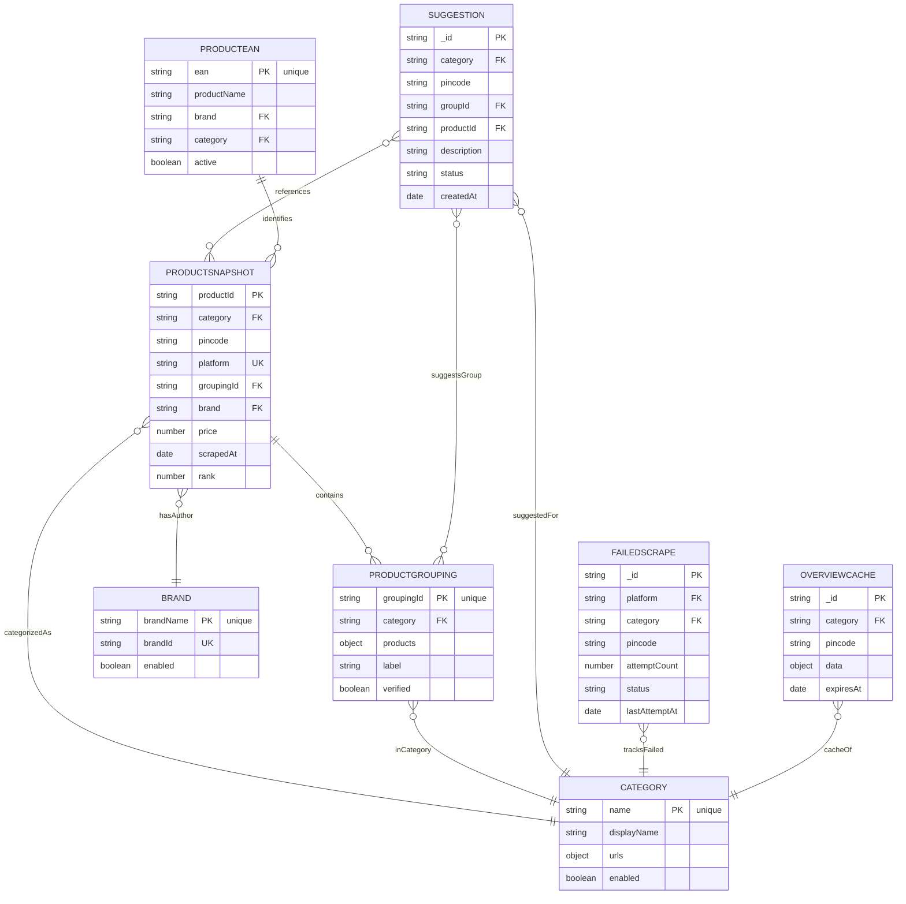

# Database Models

Complete MongoDB schema reference for all models in QuickCommerce Tracker.

## Schema Relationships

Visual representation of how all models interact:



### Relationship Summary

| From | To | Relationship | Notes |
|------|--|----|-------|
| **ProductSnapshot** | ProductGrouping | Many-to-One | References via `groupingId` |
| **ProductSnapshot** | Category | Many-to-One | References via `category` |
| **ProductSnapshot** | Brand | Many-to-One | References via `brand` |
| **ProductGrouping** | Category | Many-to-One | References via `category` |
| **Suggestion** | Category | Many-to-One | References via `category` |
| **Suggestion** | ProductSnapshot | Many-to-Many | Via `snapshotDate` and productId |
| **Suggestion** | ProductGrouping | Many-to-One | References via `groupId` |
| **FailedScrape** | Category | Many-to-One | References via `category` |
| **ProductEAN** | ProductSnapshot | One-to-Many | Identifies products via EAN |
| **ProductEAN** | Brand | Many-to-One | References via `brand` |
| **OverviewCache** | Category | Many-to-One | Caches data for category |

### Data Flow

```
Platform Scraper
    ↓
FailedScrape (if error)
    ↓
ProductSnapshot (success)
    ├─→ Brand (lookup/create)
    ├─→ Category (lookup)
    └─→ ProductGrouping (match & group)
         └─→ Suggestion (user review)
    
OverviewCache (periodic aggregation)
    └─→ ProductSnapshot (stats)

ProductEAN (product lookup)
    ├─→ ProductSnapshot (identify)
    └─→ Brand (verify)
```


## ProductSnapshot

Stores real-time product data from each platform at specific timestamps.

### Schema

```javascript
{
  // Category & Location
  category: String (required, indexed),
  categoryUrl: String (required),
  officialCategory: String,
  officialSubCategory: String,
  pincode: String (required, indexed),
  platform: Enum (required) - zepto|blinkit|jiomart|dmart|instamart|flipkartMinutes|flipkart,
  groupingId: String (indexed),
  scrapedAt: Date (required, default: now, indexed),

  // Product Details
  productId: String (required),
  skuId: String,          // DMart-specific
  variant: String,
  brand: String (indexed),
  productName: String,
  
  // Pricing & Stock
  price: Number,
  discountedPrice: Number,
  unit: String,
  stock: String,
  
  // URLs & Images
  productUrl: String,
  imageUrl: String,
  
  // Ranking
  rank: Number,           // Position in category results
  
  // Metadata
  scraped: Boolean,
  lastUpdated: Date
}
```

### Common Queries

**Get latest prices for a product:**
```javascript
db.productsnapshots.find({
  groupingId: "group_123",
  scrapedAt: { $gte: new Date(Date.now() - 24*60*60*1000) }
})
```

**Get price history for a specific platform:**
```javascript
db.productsnapshots.find({
  productId: "prod_123",
  platform: "zepto"
}).sort({ scrapedAt: -1 })
```

---

## ProductGrouping

Groups equivalent products across different platforms.

### Schema

```javascript
{
  // Grouping Identity
  groupingId: String (required, unique, indexed),
  
  // Products in Group
  products: [{
    platform: String - zepto|blinkit|jiomart|dmart|instamart|flipkartMinutes|flipkart,
    productId: String (required)
  }],
  
  label: String,
  
  // Category
  category: String (required, indexed),
  officialCategory: String (indexed),
  officialSubCategory: String,
  
  // Additional Fields
  verified: Boolean,
  verifiedAt: Date,
  matchPercentage: Number,
  
  // Metadata
  createdAt: Date (auto),
  updatedAt: Date (auto)
}
```

### Common Queries

**Find all groupings in a category:**
```javascript
db.productgroupings.find({
  category: "fruits"
})
```

**Get products in a specific group:**
```javascript
db.productgroupings.findOne({
  groupingId: "group_123"
}).then(doc => doc.products)
```

---

## Category

Master list of tracked categories and their URLs.

### Schema

```javascript
{
  // Category Identity
  name: String (required, unique),
  displayName: String (required),
  
  // Platform URLs
  urls: {
    zepto: [String],
    blinkit: [String],
    jiomart: [String],
    dmart: [String],
    instamart: [String],
    flipkart: [String]
  },
  
  // Configuration
  enabled: Boolean (default: true),
  createdAt: Date (auto),
  updatedAt: Date (auto)
}
```

### Common Queries

**Get enabled categories:**
```javascript
db.categories.find({ enabled: true })
```

**Get Zepto URL for a category:**
```javascript
db.categories.findOne({
  name: "fruits"
}, { "urls.zepto": 1 })
```

---

## Brand

Master list of all brands/manufacturers.

### Schema

```javascript
{
  // Brand Identity
  brandName: String (required, unique, trimmed),
  brandId: String (required, unique),
  
  // Configuration
  enabled: Boolean (default: true),
  createdAt: Date (auto),
  updatedAt: Date (auto)
}
```

### Common Queries

**Get all active brands:**
```javascript
db.brands.find({ enabled: true })
```

---

## Suggestion

User-submitted suggestions and feedback about products.

### Schema

```javascript
{
  // Location
  pincode: String (required, trimmed),
  category: String (required, trimmed),
  
  // Reference Data
  groupId: String (trimmed),
  productId: String (trimmed),
  snapshotDate: String (trimmed),
  productUrl: String (trimmed),
  
  // Suggestion Details
  description: String (required, trimmed),
  images: [String] (default: []),
  
  // Status & Tracking
  status: Enum - pending|completed|rejected (default: pending),
  submittedBy: String (default: "Admin"),
  
  createdAt: Date (auto),
  updatedAt: Date (auto)
}
```

### Common Queries

**Get pending suggestions:**
```javascript
db.suggestions.find({ status: "pending" })
```

**Get suggestions for a category:**
```javascript
db.suggestions.find({
  category: "fruits",
  status: { $ne: "rejected" }
})
```

---

## FailedScrape

Tracks scraping failures and retry attempts for troubleshooting.

### Schema

```javascript
{
  // Job Identification
  platform: String (required, indexed) - zepto|blinkit|jiomart|dmart,
  category: String (required, indexed),
  pincode: String (required, indexed),
  
  // Retry Tracking
  attemptCount: Number (default: 0),
  maxAttempts: Number (default: 4),
  lastAttemptAt: Date,
  
  // Error History
  errors: [{
    attempt: Number,
    apiKey: String,
    errorMessage: String,
    statusCode: Number,
    timestamp: Date (auto)
  }],
  
  // Status
  status: Enum - pending|retrying|failed|resolved,
  
  // Additional Info
  refUrl: String,
  resolvedAt: Date,
  
  createdAt: Date (auto),
  updatedAt: Date (auto)
}
```

### Common Queries

**Get failed scrapes needing retry:**
```javascript
db.failedscrapes.find({
  status: { $in: ["pending", "retrying"] },
  attemptCount: { $lt: maxAttempts }
})
```

**Get errors for a platform:**
```javascript
db.failedscrapes.find({
  platform: "zepto",
  status: "failed"
}).sort({ createdAt: -1 })
```

---

## OverviewCache

Cached analytics data for dashboard performance.

### Schema

```javascript
{
  // Cache Key
  category: String (required, indexed),
  pincode: String (required, indexed),
  
  // Cached Data
  data: Mixed (required),
  
  // Cache Management
  expiresAt: Date (required, TTL index),
  updatedAt: Date (auto)
}
```

### Common Queries

**Get cached overview for category:**
```javascript
db.overviewcaches.findOne({
  category: "fruits",
  pincode: "400706"
})
```

### TTL Index

```javascript
db.overviewcaches.createIndex(
  { expiresAt: 1 },
  { expireAfterSeconds: 0 }
)
```

---

## ProductEAN

EAN/UPC barcode mapping for products.

### Schema

```javascript
{
  // EAN Details
  ean: String (required, unique, indexed),
  
  // Product Reference
  productName: String (required),
  brand: String,
  category: String,
  
  // Additional Info
  active: Boolean (default: true),
  
  createdAt: Date (auto),
  updatedAt: Date (auto)
}
```

### Common Queries

**Search by EAN:**
```javascript
db.producteans.findOne({ ean: "8901234567890" })
```

---

## Indexes

Created indexes for optimal query performance:

```javascript
// ProductSnapshot indexes
db.productsnapshots.createIndex({ category: 1, pincode: 1, platform: 1 })
db.productsnapshots.createIndex({ groupingId: 1 })
db.productsnapshots.createIndex({ brand: 1 })
db.productsnapshots.createIndex({ scrapedAt: -1 })

// ProductGrouping indexes
db.productgroupings.createIndex({ category: 1 })
db.productgroupings.createIndex({ groupingId: 1 })

// FailedScrape indexes
db.failedscrapes.createIndex({ platform: 1, category: 1, pincode: 1 })

// Category indexes
db.categories.createIndex({ name: 1 })

// Brand indexes
db.brands.createIndex({ brandName: 1 })
```

---

## Best Practices

**Querying:**
- Always use indexed fields when possible
- Limit result sets with `.limit()`
- Use projection to fetch only needed fields

**Data Consistency:**
- ProductSnapshots should be immutable after creation
- ProductGrouping updates require verification
- FailedScrape records should be cleaned up after 30 days

**Performance:**
- ProductSnapshots are high-volume; use date ranges
- OverviewCache expires automatically after TTL
- Archive old FailedScrape records monthly
